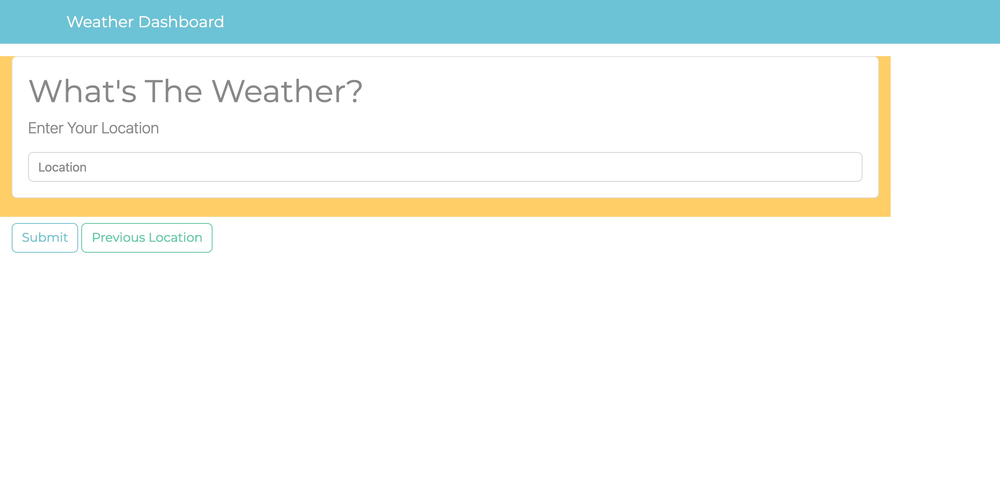
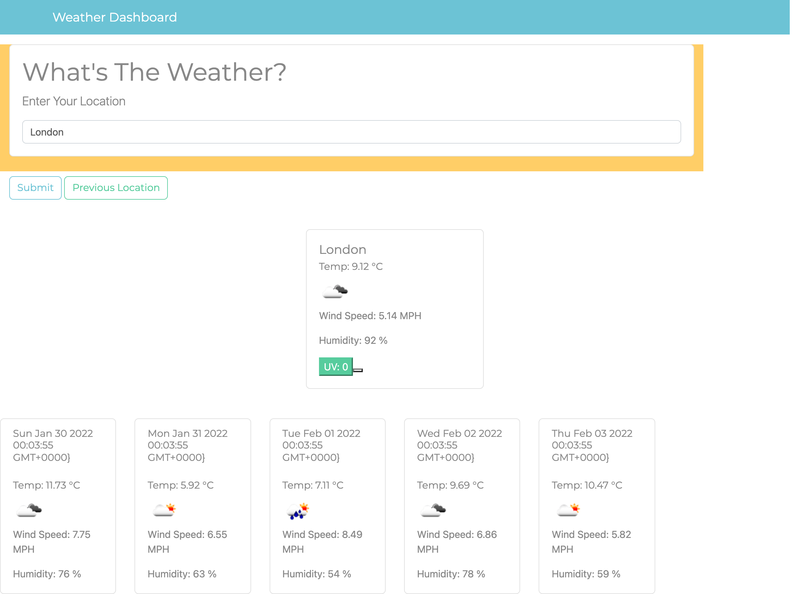
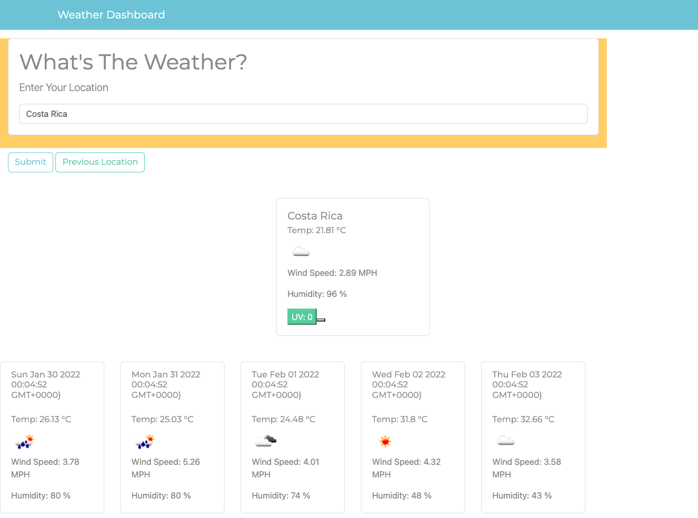
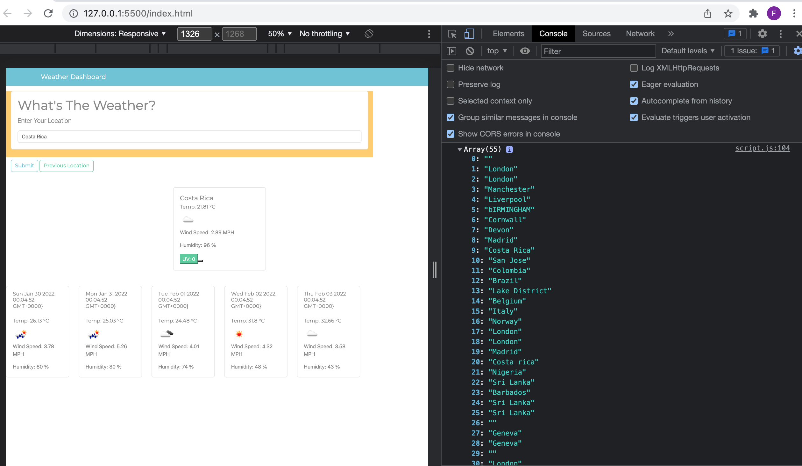
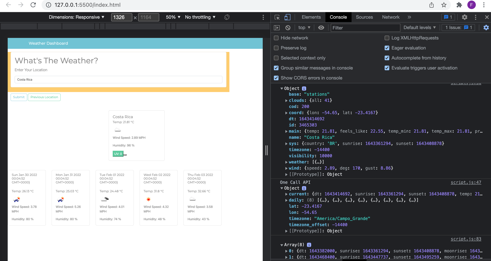
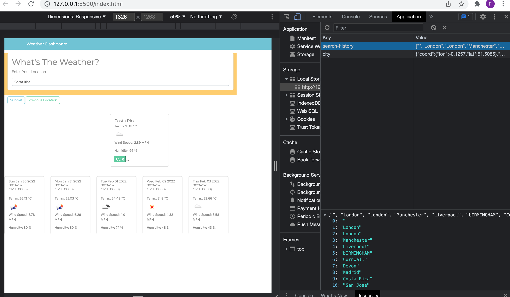

# Weather-App

Building a weather dashboard that will run in the browser and feature dynamically updated HTML and CSS and third-partys API

Why did I build this project?

The main purpose for why I built this project is so that I can learn how to use a third party API, access their data and functionality by making requests with specific parameters to a URL. The data I retreived and found relevant I used to create a weather dashboard. This project has also allowed me to enhance my skills in javascript that I have been working on the past few weeks. Examples include: variables, functions, loops, and if statements. I was also able to use jquery as a tool to simplify my code and do the heavy lifting by making it easier to write javascript.

What does this project solve?

This projects solves my ability in creating an interactive application with data retreived from a third party API on the browser with the skills I have learned so far. It also allows for the user to see the weather outlook for multiple cities. This includes weather data specified in the criteria below.

Criteria set to achieve this?

```
GIVEN a weather dashboard with form inputs
WHEN I search for a city
THEN I am presented with current and future conditions for that city and that city is added to the search history

WHEN I view current weather conditions for that city
THEN I am presented with the city name, the date, an icon representation of weather conditions, the temperature, the humidity, the wind speed, and the UV index

WHEN I view the UV index
THEN I am presented with a color that indicates whether the conditions are favorable, moderate, or severe

WHEN I view future weather conditions for that city
THEN I am presented with a 5-day forecast that displays the date, an icon representation of weather conditions, the temperature, the wind speed, and the humidity

WHEN I click on a city in the search history
THEN I am again presented with current and future conditions for that city
```

So far I have achieved?

1. Create the layout for the content on the page to be displayed using a CSS framework and html. I have also used javascript to dynamically append weather content on to the page, using cards. One for the current weather data for a location and five for the future weather forecast.

2. Successfully retreived weather data from a third party API. The API used was [OpenWeather One Call API](https://openweathermap.org/api/one-call-api).

3. With the data retreived I was able to present the city name, an icon representation of weather conditions, the temperature, the humidity, the wind speed, and the UV index.

4. I was able to present the date and time for each location entered by the user using moment.js.

5. I was able to present the forecast for the location searched for the next five days.

6. Saved users input and data retreived into local storage.

What I intend to add in the near future?

1. I would like to copmplete one of the criterias where the challenge was to display previously searched weather data on the html.

2. To have all the colours for the uv index displayed. So far even with the countries that would have a high uv index would appear as low on the browser. I'm not entirely sure if this is due to the way I wrote my if's statement or the API itself.

To access this project the following links are provided:

To access Github Repository

1. https://github.com/Farhiya1/Weather-App.git

To access Application deployed at live URL

2.  https://farhiya1.github.io/Weather-App/

Screenshot changes made can be found in images
Screenshot of deployed application

1. Screenshot displaying weather application



2. Screenshot displaying first location searched displaying current and future weather condition.



3. Screenshot displaying second location searched displaying current and future weather condition.



4. Screenshot displaying console of all the previous weather locations searched.



5. Screenshot displaying API data on console for curent and future weather.
   .

6. Screenshot displaying data saved in local storage.
   .

References

1. https://openweathermap.org/api/one-call-api
2. https://coding-boot-camp.github.io/full-stack/apis/how-to-use-api-keys
3. https://www.w3schools.com/jquery/html_html.asp
4. https://www.sitepoint.com/jquery-each-function-examples/
5. https://birmingham.bootcampcontent.com/university-of-birmingham/
   UBHM-VIRT-FSF-PT-11-2021-U-LOL
6. https://developer.mozilla.org/en-US/docs/Web/JavaScript/ ReferenceStatements/if...else
7. https://momentjs.com/
8. https://bootswatch.com/minty/
9. https://api.jquery.com/
10. https://developer.mozilla.org/en-US/docs/Web/API/Fetch_API
